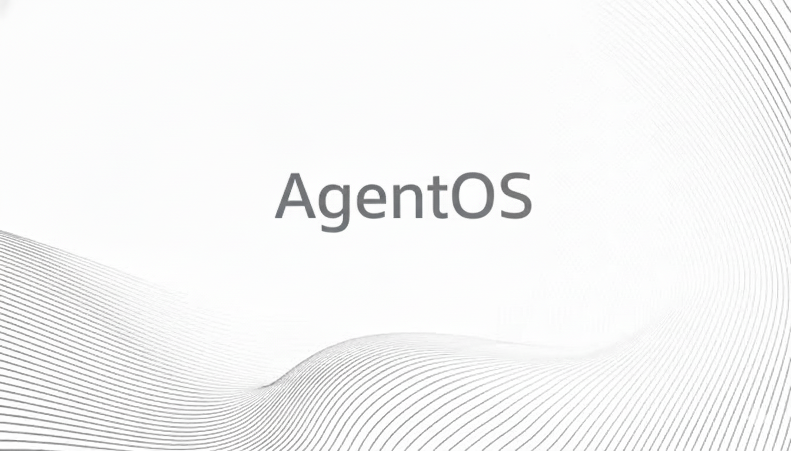

 

# 🚀 AgentOS — A Safe, Ontology-Driven Agentic Decision Platform

> **AgentOS is not a chatbot.  
It is a production-grade decision engine that combines deterministic automation, bounded AI reasoning, and human-in-the-loop control for high-stake systems.**

---

## 🧠 What Is AgentOS?

**AgentOS** is a universal, industry-agnostic **agentic decision platform** designed to operate in complex, real-world environments such as **Telecom, Energy, Finance, Manufacturing, and Operations**.

Instead of relying blindly on Large Language Models (LLMs), AgentOS is built on a **structured ontology**, **deterministic safety policies**, and **explicit execution control**, making it suitable for **enterprise and mission-critical use cases**.

---

## ✨ Why AgentOS Exists

Modern systems generate:
- Thousands of signals
- Endless dashboards
- Constant alerts

Yet the real problem remains unanswered:

> **“What should we do next — and is it safe?”**

AgentOS solves this by:
- Converting signals into **decisions**
- Explaining *why* a decision was made
- Enforcing safety constraints
- Automating only when allowed
- Keeping humans in control

---

## 🏗️ Core Design Principles

### 1️⃣ Automation First, AI Second
LLMs are **assistive**, not authoritative.

- ❌ No hallucinated actions
- ❌ No constraint bypass
- ❌ No blind execution
- ✅ Deterministic rules always win

---

### 2️⃣ Ontology-Driven Reasoning
The agent understands the world through a **shared structure**, not free-form text.

**Ontology Concepts**
- **Entity** — what the decision is about
- **State** — current condition
- **Signals** — what changed
- **Constraints** — what is forbidden
- **Actions** — what can be done
- **Outcomes** — what happened after

This makes decisions:
- Explainable
- Auditable
- Repeatable

---

### 3️⃣ Human-in-the-Loop by Design
High-stake systems require accountability.

| Action Type | Execution |
|------------|----------|
| WAIT | Autonomous |
| NOTIFY | Autonomous |
| RECOMMEND | Human decision |
| EXECUTE | Conditional |
| ESCALATE | Human required |

**AgentOS assists humans — it never replaces them.**

---

## 🧩 Architecture Overview

External Signals (APIs / Simulators) -->
Industry Adapters
-->
Core Ontology Layer
-->
Decision Engine (NBA)
-->
Safety & Policy Gates
-->
Execution Hooks (Webhooks)
-->
Outcome Feedback

---

## 🧠 The Decision Engine (NBA)

At the heart of AgentOS is the **Next-Best-Action (NBA) Engine**.

It answers:
- How urgent is this?
- How risky is acting?
- What actions are allowed?
- Should we wait, recommend, execute, or escalate?

Every decision includes:
- Confidence score
- Risk level
- Human-readable reasoning
- Audit trail

---

## 📡 Telecom Specialization (First Vertical)

AgentOS includes a **production-ready Telecom specialization**, modeled exactly how real NOCs operate.

### Supported Use Cases
- Alarm storm triage
- SLA protection
- Safe self-healing
- NOC decision support
- Incident post-mortems

### Why Telecom Works So Well
- Signal-heavy
- High blast radius
- Strict constraints
- Clear ROI for automation

---

## 🛡️ Safe Self-Healing (Not Blind Automation)

AgentOS executes automation **only if all conditions are met**:

✔ Known SOP  
✔ Low blast radius  
✔ Non-peak hours  
✔ No VIP impact  
✔ High confidence  
✔ Explicitly whitelisted  

Otherwise:
👉 Automation is blocked  
👉 Humans stay in control  

> **AgentOS automates decision timing — not actions blindly.**

---

## 🧪 Live NOC Simulation

The repository includes:
- Telecom incident simulators
- Realistic decision flows
- NOC dashboard (Streamlit)
- Execution hooks (webhooks)
- Outcome tracking

This allows:
- End-to-end demos
- Replayable scenarios
- Policy testing
- Training & validation

---

## 📊 Persistence & Auditability

Every decision and outcome is stored.

You can:
- Replay decisions
- Analyze failures
- Measure impact
- Prove compliance

This is essential for:
- Regulated industries
- Enterprise adoption
- Trust building

---

## 🧠 Why AgentOS Is Different

| Typical AI Agents | AgentOS |
|------------------|--------|
| Text-based | Ontology-driven |
| Black-box | Explainable |
| LLM-dependent | Deterministic core |
| Autonomous | Human-controlled |
| Demo-grade | Production-ready |

---

## 🧭 Industry Expansion

AgentOS is built as a **platform**, not a single solution.

New industries plug in via:
- Adapters
- Policies
- SOP registries

Planned specializations:
- 🔌 Telecom Core (AAA / Diameter / PCRF)
- ⚡ Energy & Trading
- 🏭 Manufacturing & IoT
- 🏦 Finance & Risk Ops

---

## 🚦 Current Status

✔ Core Agent Engine  
✔ Ontology Layer  
✔ Safe LLM Integration (Mocked)  
✔ Persistence Layer  
✔ Outcome Feedback Loop  
✔ Telecom Specialization  
✔ Live NOC Demo  
✔ Execution Hooks  

**This is a deployable MVP — not a toy project.**

---

## 🎯 One-Line Summary

> **AgentOS is a universal, ontology-driven decision platform that safely combines automation, AI reasoning, and human judgment for high-stake systems.**

---

## 📜 License

MIT (for now)

---

## 👤 Author

Built by an engineer with deep experience in:
- Telecom (AAA, DIAMETER)
- Agentic systems
- Distributed decision engines
- Production-grade AI design

---

> **If you can explain why your AI made a decision,  
control when it acts,  
and prove what happened —  
then you can deploy it.  
AgentOS exists for that reason.**
